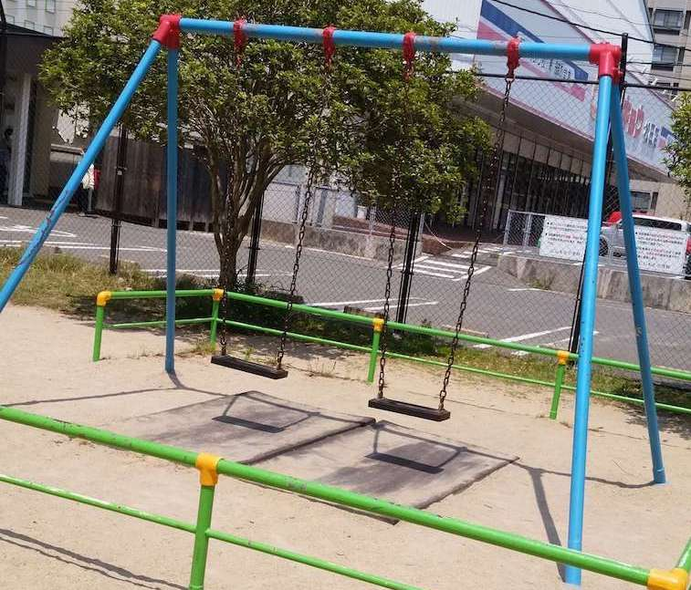
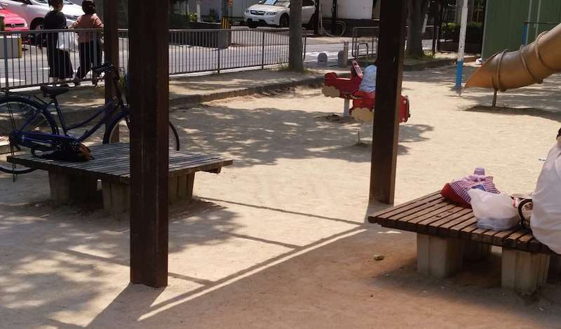

福岡県福岡市東区松田3丁目11  
最寄り駅：柚須  
あんまり広くない。  

<!-- end -->

## 入口

## 遊具
  

## 鉄棒

## ブランコ

## ぶら下がり健康器

## 砂場

## ベンチ

## グラウンド

# 地図
<iframe src="https://www.google.com/maps/embed?pb=!1m14!1m8!1m3!1d7381.6162292254985!2d130.4414308541895!3d33.6180547613002!3m2!1i1024!2i768!4f13.1!3m3!1m2!1s0x35418fb8b435f1b9%3A0x9765e360b706ebde!2sMatsudahigashi+Park!5e0!3m2!1sen!2sjp!4v1557625311591!5m2!1sen!2sjp" width="600" height="450" frameborder="0" style="border:0" allowfullscreen></iframe>

