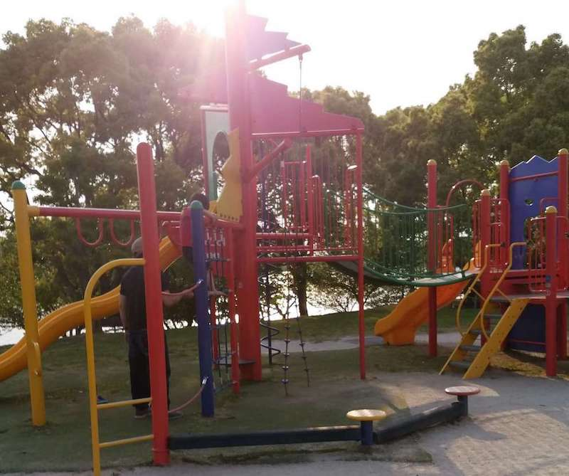

福岡県糟屋郡粕屋町駕与丁3丁目2-1  
最寄り駅：長者原/酒殿  
めっさ広いけど、子供ば遊ぶ場所は少なめ。  

<!-- end --> 
ランニングコースも長い。  
お花がいっぱい咲いてるけど、ここ紹介するのは子供向けの遊具メインだよ。

## 遊具１

## 遊具２
  

## 遊具３
  

# 地図
<iframe src="https://www.google.com/maps/embed?pb=!1m18!1m12!1m3!1d3322.8234208559797!2d130.48166301520348!3d33.609885780728646!2m3!1f0!2f0!3f0!3m2!1i1024!2i768!4f13.1!3m3!1m2!1s0x3541856fd108629b%3A0x9841e301d8b811b4!2s3-ch%C5%8Dme-2-1+Kayoich%C5%8D%2C+Kasuya%2C+Kasuya-gun%2C+Fukuoka+811-2309!5e0!3m2!1sen!2sjp!4v1557628611183!5m2!1sen!2sjp" width="600" height="450" frameborder="0" style="border:0" allowfullscreen></iframe>

