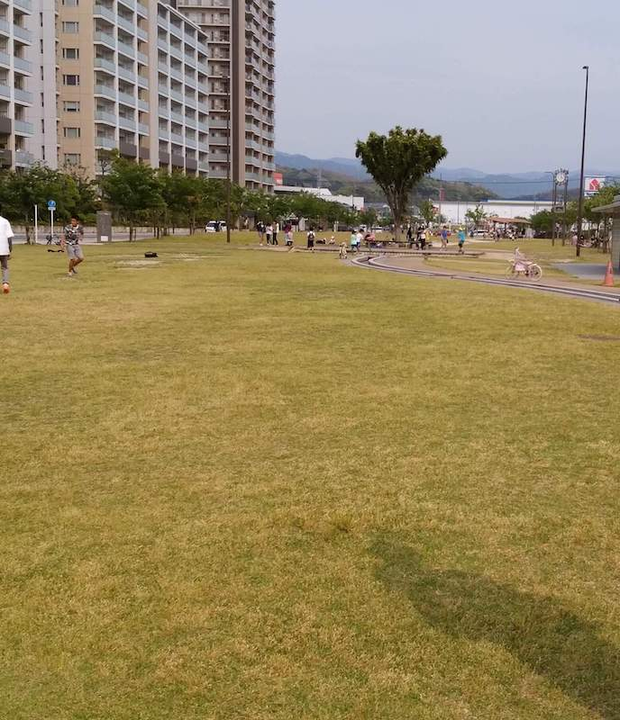
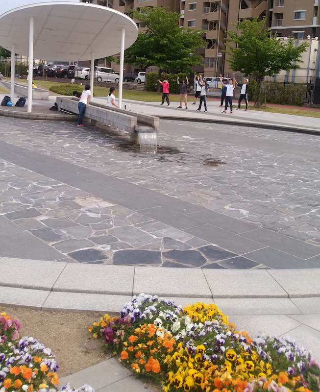
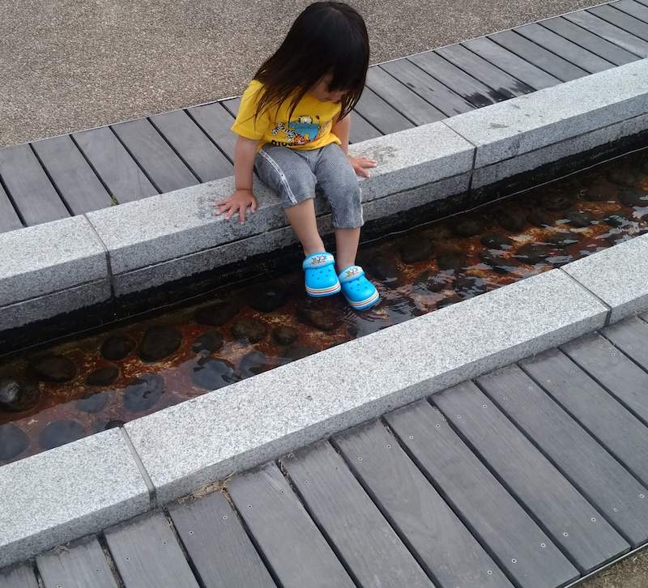
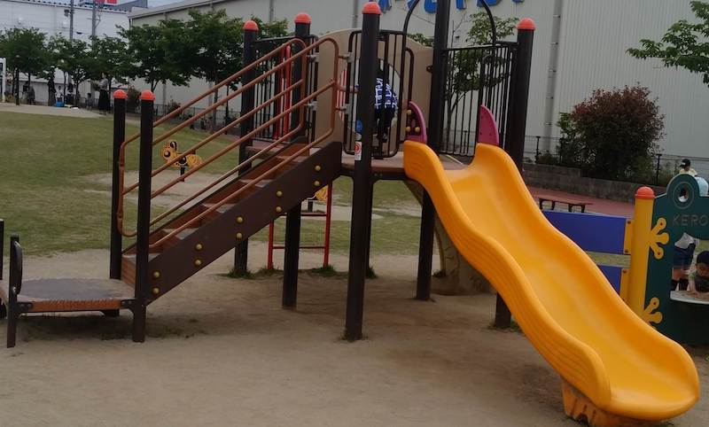
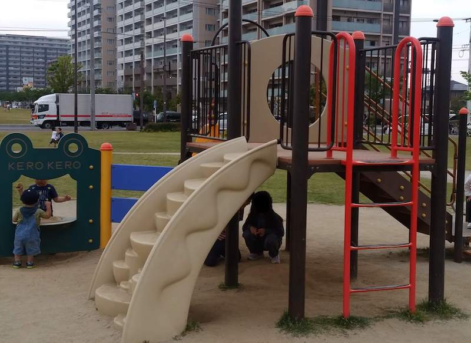
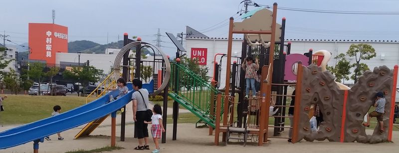
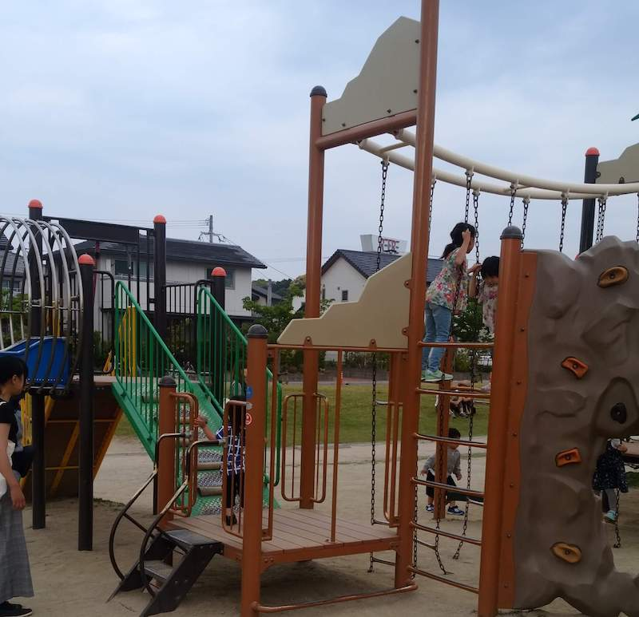
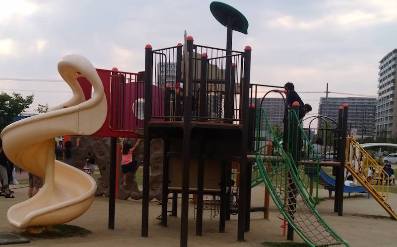

IKEAの近く。  
新宮町中央駅前二丁目3番  
最寄り駅：新宮中央  
広い。  

<!-- end --> 
キャスターボードやダンスをしている人もちらほら。  
水遊び可。  

## 広場e
  

## 水遊び

## 遊具１
  

## 遊具２
  
  

# 地図
<iframe src="https://www.google.com/maps/embed?pb=!1m14!1m8!1m3!1d13275.741238316725!2d130.4523514!3d33.7106228!3m2!1i1024!2i768!4f13.1!3m3!1m2!1s0x0%3A0xac4d3994a5034003!2sOkita+Central+Park!5e0!3m2!1sen!2sjp!4v1557679267511!5m2!1sen!2sjp" width="600" height="450" frameborder="0" style="border:0" allowfullscreen></iframe>

