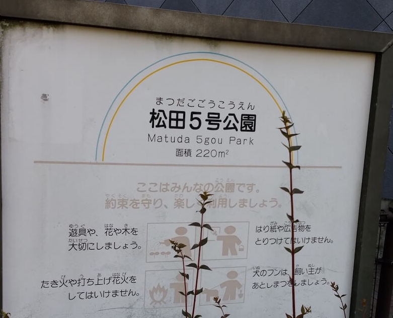
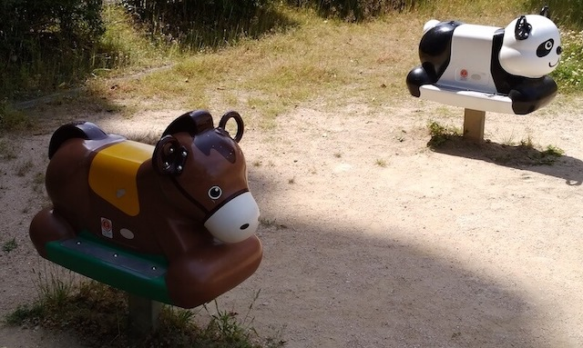
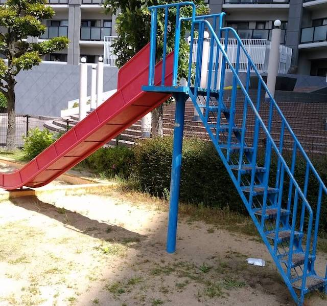
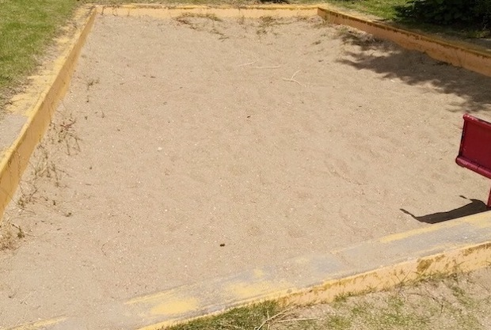

一見、マンション付属の公園っぽい。  
小さい。  
福岡県福岡市東区東区松田３丁目１７
最寄り駅：柚須  
トイレ：なし  

<!-- end --> 

## 入口
  

## 乗り物
  

## 滑り台
  

## 砂場
  

# 地図
<iframe src="https://www.google.com/maps/embed?pb=!1m18!1m12!1m3!1d26582.363326125716!2d130.4329657461464!3d33.61061231659963!2m3!1f0!2f0!3f0!3m2!1i1024!2i768!4f13.1!3m3!1m2!1s0x35418fb9288b4935%3A0x9938a84796b67e4f!2sMatsuda+5+Go+Park!5e0!3m2!1sen!2sjp!4v1558212526445!5m2!1sen!2sjp" width="600" height="450" frameborder="0" style="border:0" allowfullscreen></iframe>
